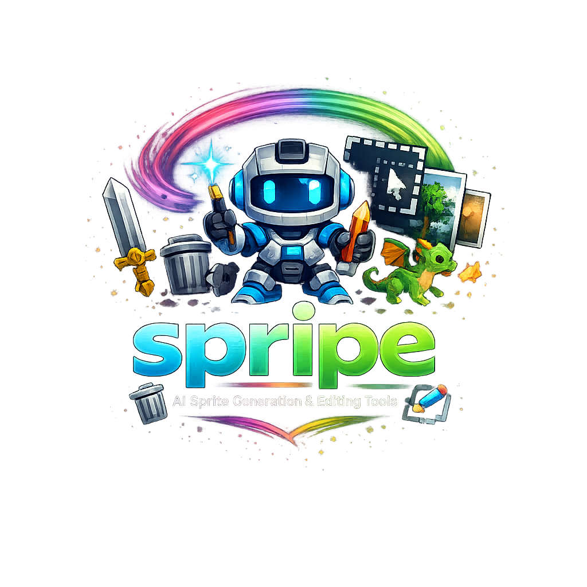

<div align="center">
  
  
  # Spripe
  
  **An Open-Source AI-Powered Asset & Sprite Generation Pipeline**
  
  [](https://www.python.org/)
  [](https://riverbankcomputing.com/software/pyqt/intro)
  [](https://opencv.org/)
  [](https://github.com/danielgatis/rembg)
  [](https://numpy.org/)
</div>

---

**Spripe** is an end-to-end open-source toolkit designed to rapidly generate, process, normalize, and polish 2D sprites from video files. Built specifically for game developers and animators, it takes raw gameplay or animation videos and transforms them into game-ready, perfectly aligned transparent PNG sequences using advanced AI background removal.

## ✨ Features

- **🤖 AI Background Extraction:** Feed it an `.mp4` or a folder of PNGs, and Spripe uses `rembg` (U-Net based neural networks) to isolate the character, regardless of complex backgrounds, shadows, or gradients.
- **📐 Automatic Normalization:** Characters are automatically scaled to a consistent height and their feet are aligned to a standard baseline, ensuring fluid continuous animation transitions (e.g., from *idle* to *jump*).
- **🎨 Advanced GUI Editor:** Includes a built-in PyQt6 painting environment tailored for sprite cleanup:
  - **GrabCut Quick Selection:** Drag a box, and OpenCV AI seamlessly cuts out artifacts.
  - **Magic Wand & Lassos:** Select regions with adjustable tolerances and morphological contour smoothing.
  - **Non-Destructive Workflows:** Easily paint, erase alpha channels, soft-brush, and eyedrop directly over your frames.
  - **📌 Pinned Keyframe (Onion Skinning):** Pin any frame as a transparent overlay to perfectly align and compare positioning across different animations!
- **🎞️ Timeline & Playback:** Manage your frames in a dedicated timeline. Drag-and-drop to reorder, delete multiple frames at once, preview animations in real-time at 12 FPS, or toggle "Boomerang" mode. Smooth asynchronous background loading keeps the GUI butter-smooth.
- **🗂️ Project Workspace:** Robust hierarchical organization (Projects -> Assets -> Animations). Effortlessly manage multiple characters and their movesets with full right-click context menu support.
- **📦 Export System:** Instantly export single animations or entire assets into engine-ready structured folders or ZIP archives.

## 🛠️ The Workflow

Spripe simplifies sprite generation into a highly automated 4-step process:

1. **Import:** Use the GUI to create a Project and Asset, then import your source `.mp4` files or PNG sequences directly.
2. **AI Generation (`process_python.py`):** The engine processes the video, extracting frames at your desired FPS and stripping the background using AI. Results go to `raw_output/`.
3. **Normalize (`normalize_animations.py`):** Run the normalizer (via the Pipeline Controls or right-click context menu) to scale the character and align their feet onto a unified 16:9 canvas space. Results go to `normalized_output/`.
4. **Polish & Export (GUI):** Open the Spripe GUI to manually review the sequence. Use the timeline to delete bad frames, drag-and-drop to fix ordering, and use the Painter tools to erase lingering background artifacts. Finally, right-click to export your polished sprites to a `.zip` file!

## 🚀 Installation & Setup

Spripe is now a fully installable Python package!

1. Clone this repository.
2. Navigate to the project directory and install it via pip. You can choose whether you want the CPU or GPU version for AI background removal:
   
   **For CPU processing:**
   ```powershell
   pip install -e .[cpu]
   ```
   
   **For GPU processing (NVIDIA/CUDA - Much Faster):**
   ```powershell
   pip install -e .[gpu]
   ```

Alternatively, you can build a standalone Windows executable by running `python build_exe.py`.

## 🎮 How to Use

### 1. Launching the GUI

The easiest way to use Spripe is through its visual interface. It acts as a control center for the entire pipeline. Once installed, simply type:

```powershell
spripe gui
# or just
spripe
```

From the GUI, you can:
- **Organize:** Use the left-hand Asset Browser to manage your projects (Right-click for options).
- **Process:** Trigger the AI Processing and Normalization scripts seamlessly in the background.
- **Edit:** Preview and manually paint/edit frames. Use the "Pin Frame" feature to check alignments.
- **Export:** Right click any Asset or Animation to package it into an engine-ready ZIP.

### 2. Command Line Processing

If you prefer batch processing or terminal workflows, you can run the core scripts directly via the `spripe` CLI.

**Extract frames and remove background:**
```powershell
spripe process --video .\videos\idle.mp4 --out .\raw_output\
```

**Normalize Scale and Position:**
```powershell
spripe normalize --project MyGame --asset Ninja
# Or by path
spripe normalize --path .\raw_output\idle
```

**Fix Frame Numbering or Reverse:**
If you manually delete files via the file explorer, you can fix the numbering gaps or reverse them:
```powershell
spripe rename --path .\raw_output\idle
spripe reverse --path .\raw_output\idle
```

## 🤝 Contributing
Contributions, issues, and feature requests are welcome! Feel free to check the issues page.

## 📝 License
This project is open-source and available under the MIT License.
